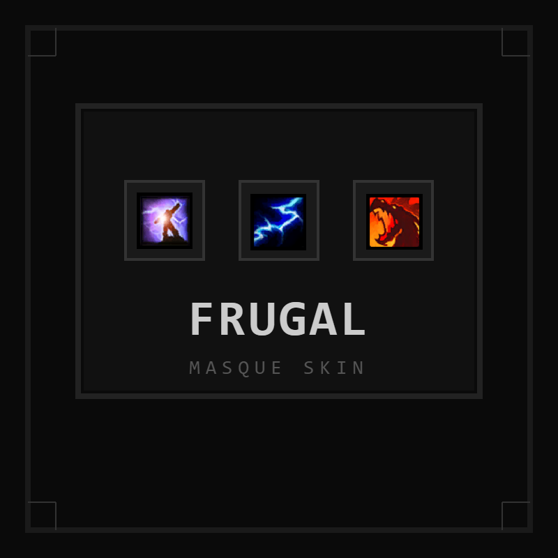

# Masque: Frugal

A flat, square, dark skin for [Masque](https://www.curseforge.com/wow/addons/masque).

## About

Frugal is a minimalist Masque skin with sharp square icons, solid black backdrops, thin borders, and no gloss or shine effects. It works with any addon that supports Masque — action bars, bags, buffs, and more.

## Features

- Square icon shape with cropped edges
- Solid black backdrop
- Thin dark border frame
- No gloss, no shine — pure flat aesthetic
- All 37 Masque skin layers defined

## Requirements

- [Masque](https://www.curseforge.com/wow/addons/masque)

## Installation

1. Download the latest release from [GitHub Releases](https://github.com/afrugalpenguin/masque-frugal/releases) or [CurseForge](https://www.curseforge.com/wow/addons/masque-frugal)
2. Extract `Masque_Frugal/` into your `Interface/AddOns/` folder
3. In-game, type `/msq` and select **Frugal**

## Compatible Addons

Any addon that uses Masque, including:

- FrugalUI
- Castborn
- Bartender4
- Dominos
- ElvUI
- Bagnon
- AdiBags
- And many more

## License

MIT
